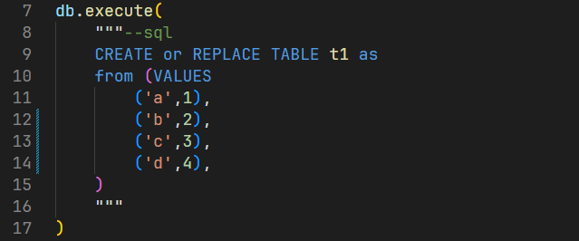

# dabbler
An IPython extension and sql language server (for sql text with python files) that works with DuckDB.  This project includes a vscode extension to work with the language server.  This project is a work in progress and there could be many bugs.

Table/Query browser:


Intellisnse / autocomplete:


### Features:
- A window to view tables and queries
- Auto completion for:
    - ✔️tables 
    - ✔️columns 
        - should work for tables, views, CTEs, table functions, and subqueries
    - ✔️functions names
    - ✔️file paths (triggered by characters **`'./`**  )
    - ✔️keywords
    - 🔲function signature / parameters
- Send/Execute SQL query from vscode editor to view in dabbler window

### Current Limitations
- The parser does not yet support every SQL feature in the duckdb dialect and it will fail to provide autocompletion if it cannot parse the SQL, this problem can be avoided in some cases by seperating statements into different blocks of text
- This currently only works with the "Python Interactive Window" in vscode - here is an article that explains how the interactive window works: https://code.visualstudio.com/docs/python/jupyter-support-py
- does not work well with python f-strings


### Install / Setup
#### Prerequisites
- Install VSCode
- Install Python VScode Extension
- Install Jupyter VScode Extension
#### Install dabbler
- `pip install dabbler` (note: one of the depenecies is "notebook" which is Jupyter Notebook - this installs a ton of stuff)
- install PySide or PyQt e.g. `pip install PySide6`  (note: pyqt5 seems to work better on Linux)
- install "dabbler" vscode extension

#### Setup
- For the language server to work in VScode you need to have dabbler installed in the python enviornment that is active in VScode.  
    - Alternatively you can set the default enviornment for the language server in VScode settings
- In vscode python settings you can enable line magics for python files:
    - open settings by pressing: `ctr+,`
    - search for "line magic" and check the box:
       >
- Use the line magic to load dabbler after making the duckdb connection as shown below.  Run the cell to start the "Interactive Window" in vscode. *note: If the file is run as a normal script the line-magic does not get executed*
    ```py
    #%%
    import duckdb
    db = duckdb.connect()
    #!%load_ext dabbler.ext
    ```

- In vscode you can set a keyboard shortcut to the dabbler command run the select node that your cursor is on in the GUI windown
  - press: `ctrl-shit-p` to bring up the command pallette
  - type in "keyboard" to find the open keyboard shortcuts command
  - with the keyboard shortcuts window search for "dabbler" and you can then assign a keybinding


### Overview
- The dabbler python package inlcudes a pygls language server.
    - The vscode extension starts the language server by running: `py -m dabbler.lsp`
- The language server communicates with ipython/jupyter to get table and column names using zmq
    - the IPython extension checks for updates to the database/dataframes each time cells are exectued using the ipython pre_run_cell and post_run_cell events
    - table/column information is sent from IPython to the language server upon the initial connection and after cell execution (if there are changes)
- The language server includes an SQL parser created from using lark package
    - Within the python document ranges SQL text are idenitified using regular expressions:
        ```py
        re_patterns = [
            r'([^\n]*?"""--sql[^\n]*?\n)(?P<sql>.*?)(""")',
            r'(.(sql|execute|executemany)\(")(?P<sql>.*?)("\s*(\)|,))',
            r"(.(sql|execute|executemany)\(')(?P<sql>.*?)('\s*(\)|,))",
            ]
        ```
        - example:
        
            
    - If changes are made to the document within an sql text range the only that range of text is parsed and if there is an error that is published to the client.  Since the parse is not 100% complete at this point the parser could return errors that due parse in DuckDb.


### Next steps
- Updates to vs_code extension
    - make configuration option to set default python env
    - better handling of server failing to start when dabbler not installed in python env
- SQL grammer features missing:
    - SQL standard syntax for pivot/unpivot (simplified is supported)
    - delete statement
    - update statement
    - qualify clause
    - grouping sets, cube, rollup


### Future Improvement Ideas:
- GUI
    - Query history
    - Query manipulation - pivot filter
    - Column selector - hide columns
    - page history - press page up or page down
    - Configuration - retain information / setting on per file basis (file launched from)
        - query history
        - use full path or minimal path for tables
        - linting settings (if implemented)
- Language Server
    - Function signature helpers
    - Ability to connect to database file directly
        - could have the language server read a special comment line in python file that tells it what database to use for that file.
    - SQL Validation / Linting
    - Autocomplete for files
    - Add Notebook support
    - Tailor the syntax highlighting to DuckDB, I think this can be done by modifying a copy of this file: https://github.com/microsoft/vscode/blob/fa99dace5ee3b35a070ca4970422621af07c2781/extensions/sql/syntaxes/sql.tmLanguage.json


